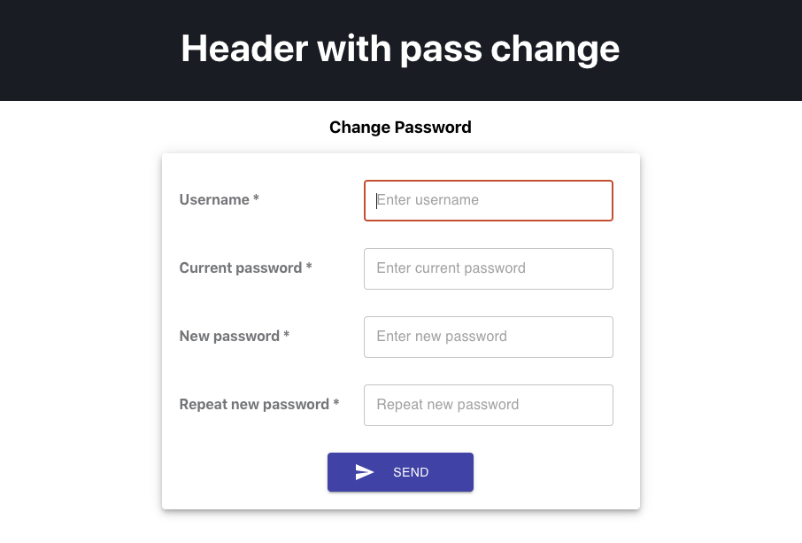

# Change password
  User Password Change Form using React and MaterialUI (TextField, Snackbar, Alert)

  ## Main view of the application

In the project directory, you can run:

### `npm start`

The build is minified and the filenames include the hashes. 