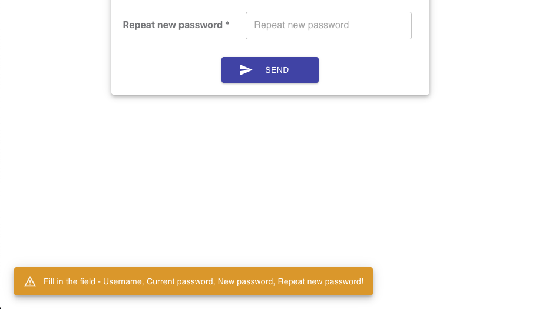

# Change password
  User Password Change Form using React and MaterialUI (TextField, Snackbar, Alert)

The application uses validation of all required fields. Validates:
    - empty required field
    - mismatch of the current and new password
    - match the new password and repeat the new password
    - validation of backend responses is also provided

For validation errors, the field is highlighted in red and a warning message is displayed.

  ## Main view of the application

  ## Snackbar view

In the project directory, you can run:

### `npm start`

The build is minified and the filenames include the hashes. 